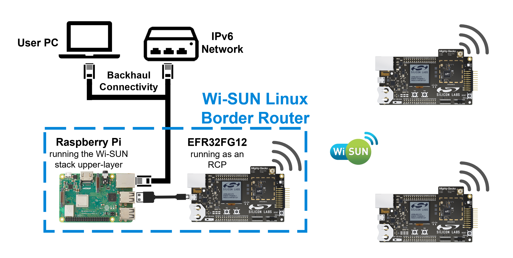

<table border="0">
  <tr>
    <td align="left" valign="middle">
    <h1>Wi-SUN Border Router Container</h1>
  </td>
  <td align="left" valign="middle">
    
  </td>
  </tr>
</table>

In a Wi-SUN network, the Border Router (BR) is in charge of managing the network
(authentication, routing, etc.) and providing internet connectivity to the
network.

This Docker image is provided to simplify the deployment and network
configuration. It is developed for running on a Raspberry Pi and Raspberry Pi OS
(a port of Debian for Raspberry Pi), but it should work on any Linux host.

This implementation relies on an external Silicon Labs EFR32xG12 flashed with a
dedicated Wi-SUN RCP (Radio Coprocessor) firmware. To this end, the EFR32 is
connected to the host through USB. Using this connection, the Docker image sees
the EFR32 device as a serial (UART) connection. This document describes how to
set up the system shown below.

The use of a network with IPv6 connectivity is encouraged. If IPv6 is not
available, you can use "local" or "site-local" modes (these modes have some
pitfalls, see below).

# Prerequisites

The document requires the following hardware prerequisites:
* A Raspberry Pi 3 Model B+ or newer
* An SD card of at least 8 GB
* A Silicon Labs WTSK mainboard
* An EFR32MG12 or EFR32FG12 radio board supporting a sub-GHz band

To flash Raspberry Pi OS on the SD card, follow [the steps described by the
Raspberry Pi Foundation.][1]

It is recommended to update and upgrade your OS. To do so, connect the Raspberry
Pi to internet via Ethernet or Wi-Fi and open a console or SSH (Secure Shell)
session.

Update the package database:

    sudo apt-get update

Upgrade installed packages:

    sudo apt-get upgrade

[1]: https://www.raspberrypi.org/software/

# Build the Docker Image

For the time being, the Docker image has to be built. To build and run Docker
images, first install the `docker` application.

    sudo apt-get install docker.io

Make sure that your current user is allowed to run Docker:

    sudo usermod -aG docker pi

> You have to log out and back in for this to take effect.

For the next step, the Raspberry Pi needs access to this private GitHub
repository. We recommend you follow [GitHub guidelines on how to set up a new
SSH key on your Pi][2]. Refer to the Linux documentation to create or use an SSH
key.

You should now be able to clone the repository on your Raspberry Pi:

    git clone git@github.com:SiliconLabs/wisun-br-linux-docker.git

Enter the `wisun-br-linux-docker` directory:

    cd wisun-br-linux-docker

Build the image with:

    DOCKER_BUILDKIT=1 docker build --build-arg "GIT_DESCRIBE=$(git describe --tag --match v*)" --ssh default -t wisun-img .

Note that `DOCKER_BUILDKIT` and `--ssh` are necessary to authenticate to the
Github private git repository. If this step fails, check the section [I have an
error while retrieving `wsbrd`
sources.](#i-have-an-error-while-retrieving-wsbrd-sources)

You may save memory by removing the build environment and only keeping the final
image:

    docker image prune

If you have an IPv6 network, create a macvlan interface to allow the Docker
image to access it (replace `eth0` by the name of your physical network
interface):

    sudo docker network create -d macvlan -o parent=eth0 wisun-net

> Details on Docker and macvlan can be found [here][3].

[2]: https://docs.github.com/en/authentication/connecting-to-github-with-ssh/adding-a-new-ssh-key-to-your-github-account
[3]: https://docs.docker.com/network/macvlan/

# Launching the Wi-SUN Docker Image

> Before you continue, you have to be aware that, if no IPv6 network is detected
> (and no command line option prevents it), the image advertises a network
> configuration. It may impact the other hosts on your network. To avoid any
> inconvenience, we suggest working with an isolated network. See also [Can this
> image break my local network?](#can-this-image-break-my-local-network)

At this stage, you have:
 * A Docker image named `wisun-img`, running the Wi-SUN stack upper-layer and a
   communication protocol to control an EFR32 running the Wi-SUN RCP image.
 * A macvlan interface named `wisun-net`, allowing a Docker container to access
   one of the Raspberry Pi IP communication interfaces (by default `eth0`).

Before connecting the mainboard to your Linux host, start dmesg to monitor new
connected devices:

    dmesg -w

Next, connect the mainboard with the EFR32 radio board to the Raspberry Pi
through USB. Check the name of the new connected device in the dmesg output (by
default `/dev/ttyACM0`). If the device name is different, pass the correct
device name with `-d` (`--device`) in the following `docker run` command.

Launch your image using:

    docker run -ti --privileged --rm --network=wisun-net --name=wisun-vm wisun-img --flash -

> The `--flash -` option flashes the EFR32 with the default RCP image. More
> information in the [Using the JTAG Link](#using-the-jtag-link) section.

From now on, the Linux Wi-SUN border router should be running and you should be
able to connect Wi-SUN nodes to it.

Note that the Docker image accepts several options which you can list with:

    docker run -ti --privileged --rm wisun-img --help

You may want to open a shell into the container:

    docker exec -ti wisun-vm sh

> Advanced users may want to drop the `--rm` option and work with `docker
> start`, `docker stop`, etc...

# Using the JTAG Link

The Docker image is able to use the JTAG link available with the Silicon Labs
chips to configure the Wi-SUN parameters, flash the radio board or retrieve chip
traces.

You can start the container with `--flash -` to flash the connected board with
the built-in firmware. This firmware works with the EFR23xG12 radio boards
supporting a Wi-SUN sub-GHz RF band:

    docker run -ti --privileged --rm --network=wisun-net --name=wisun-vm wisun-img --flash -

> Replace "-" by another path to flash a custom firmware.

You can also use the JTAG link to retrieve traces from the radio board. You can
either pass `-T` to the `docker run` command or start the traces afterward with
`wisun-device-traces` command:

    docker exec -ti wisun-vm wisun-device-traces

# Bugs and Limitations

## I have an error while retrieving `wsbrd` sources

`wsbrd` is hosted on a private repository. You need to have a running
`ssh-agent` with your key inside to access the repository.

To see if your environment is correct, check if your key appears in the output
of:

    ssh-add -l

The process to work with ssh keys is described at length in the [GitHub
documentation][4]. To summarize, if `ssh-add` cannot open a connection to your
authentication agent, you can run a local agent with:

    eval $(ssh-agent)

If the agent has no identities, ensure that your key file is available under `
~/.ssh` and register them with:

    ssh-add <key_file>

Finally, check that you are able to clone the repository:

    git clone ssh://git@github.com/SiliconLabs/wisun-br-linux

If you still don't have access, maybe your key does not match the key of your
GitHub account or you don't have permission to access the `wisun-br-linux`
repository.

[4]: https://docs.github.com/en/github/authenticating-to-github/connecting-to-github-with-ssh

## I want to use this architecture for production

By default, this Docker image uses a method called Neighbor Discovery Protocol
Proxy (NDP Proxy). It works with most IPv6 network topologies without touching
the network infrastructure.  However, it does not scale very well and you may
find limitations in corner cases. For production, use the subnet mode (aka
Prefix Delegation) or even better use DHCPv6-PD protocol (not presented in this
Docker image).

## I have no IPv6 network

This project does not aim to provide IPv6 connectivity. If your ISP does not
provide IPv6, you can either:

  - get equipment providing IPv6 through NAT64 or 6to4
  - get equipment advertising a site-local IPv6 prefix (eg. fd01::/64). You
    can do that using radvd with any standard Linux.

## The container does not detect my IPv6 network

The container relies on Router Advertisements. If your network uses DHCPv6, or
does not have Router Advertisement for any reason, the container won't detect
the network.

## Cannot reach (IPv4) Internet from the container

This happens when you use the macvlan driver. It is necessary to get an IP from
the DHCP server of the host network. Just add `-D` when you run the Docker image
to run a DHCP client:

    docker run -ti --privileged --rm --network=wisun-net --name=wisun-vm wisun-img -D

## I have restarted my Docker image and I can't ping my Wi-SUN device anymore

The proxy creates the necessary routes when it receives a Neighbor Solicitation.
Your host has probably cached this information. The easiest way to fix that is
to flush the neighbor information of your host with:

    ip -6 neigh flush dev eth0

Alternatively you can force a neighbor discovery on your Wi-SUN node:

    ndisc6 2a01:e35:2435:66a0:202:f7ff:fef0:0 eth0

## Wi-SUN can reach an outside network, but can't reach Docker host

It is a [limitation of the macvlan interface][5]. This situation is actually not
an error — it is the defined behavior of macvtap. Due to the way in which the
host's physical Ethernet is attached to the macvtap bridge, traffic into that
bridge from the guests that is forwarded to the physical interface cannot be
bounced back up to the host's IP stack. Additionally, traffic from the host's IP
stack that is sent to the physical interface cannot be bounced back up to the
macvtap bridge for forwarding to the guests.

There are several ways to work around the problem. The easiest way probably is
to use a secondary physical network interface exclusively for the guest.

    dhcpcd --release eth1
    docker network create -d macvlan -o parent=eth1 wisun-net
    ip link set dev eth1 up
    docker run -ti --privileged --rm --network=wisun-net --name=wisun-vm wisun-img

[5]: https://access.redhat.com/documentation/en-US/Red_Hat_Enterprise_Linux/6/html/Virtualization_Host_Configuration_and_Guest_Installation_Guide/App_Macvtap.html

## Unable to launch the container on my Windows workstation

This project has not yet been tested on Windows hosts. It seems it should work
as soon as you use Windows Subsystem for Linux (WSL2) and the USB-UART of the
Wi-SUN BR is handled by WSL2. In other words, you should see /dev/ttyUSB0 on
WSL2.

## I have reconnected the mainboard and nothing works

The Docker container does not (yet) support device hot-plugging. You have to
restart the Docker container if you unplug the mainboard with the EFR32 radio
board.

## When I try to ping from my Wi-SUN Device, the reply is transmitted after 5s of latency

When using the proxy, it takes a few seconds to establish connection the first
time an end device tries to access the outside. The problem is [ndppd does not
receive locally generated neighbor solicitation][6] (A). The system unlocks when
a solicitation comes from outside (B).

        tun0  2 1.806167960 2a01:e35:2435:66a0:20d:6fff:fe20:c096 → 2a00:1450:4007:809::200e ICMPv6 104 Echo (ping) request id=0x0001, seq=0, hop limit=63
        eth0  1 0.000000000 2a01:e35:2435:66a0:20d:6fff:fe20:c096 → 2a00:1450:4007:809::200e ICMPv6 118 Echo (ping) request id=0x0001, seq=0, hop limit=62
        eth0  2 0.007452561 2a00:1450:4007:809::200e → 2a01:e35:2435:66a0:20d:6fff:fe20:c096 ICMPv6 118 Echo (ping) reply id=0x0001, seq=0, hop limit=118 (request in 1)
    (A) eth0  3 0.007558306 fe80::42:acff:fe13:2 → ff02::1:ff20:c096 ICMPv6 86 Neighbor Solicitation for 2a01:e35:2435:66a0:20d:6fff:fe20:c096 from 02:42:ac:13:00:02
    (A) eth0  4 1.016063581 fe80::42:acff:fe13:2 → ff02::1:ff20:c096 ICMPv6 86 Neighbor Solicitation for 2a01:e35:2435:66a0:20d:6fff:fe20:c096 from 02:42:ac:13:00:02
    (A) eth0  5 2.039971376 fe80::42:acff:fe13:2 → ff02::1:ff20:c096 ICMPv6 86 Neighbor Solicitation for 2a01:e35:2435:66a0:20d:6fff:fe20:c096 from 02:42:ac:13:00:02
        eth0  6 3.060057826 2a01:e35:2435:66a0:42:acff:fe13:2 → 2a00:1450:4007:809::200e ICMPv6 166 Destination Unreachable (Address unreachable)
    (B) eth0  7 5.043717586 fe80::224:d4ff:fea3:4493 → 2a01:e35:2435:66a0:20d:6fff:fe20:c096 ICMPv6 86 Neighbor Solicitation for 2a01:e35:2435:66a0:20d:6fff:fe20:c096 from 00:24:d4:a3:44:93
        eth0  8 5.043761372 fe80::42:acff:fe13:2 → fe80::224:d4ff:fea3:4493 ICMPv6 174 Redirect
        eth0  9 5.043782371 fe80::42:acff:fe13:2 → ff02::1:ff20:c096 ICMPv6 86 Neighbor Solicitation for 2a01:e35:2435:66a0:20d:6fff:fe20:c096 from 02:42:ac:13:00:02
    (B) tun0  3 6.850276506 fe80::10c3:41bf:aa66:69a3 → ff02::1:ff20:c096 ICMPv6 72 Neighbor Solicitation for 2a01:e35:2435:66a0:20d:6fff:fe20:c096 from 00:00:00:00:00:00
        tun0  4 6.870837671 fe80::202:f7ff:fef0:0 → fe80::10c3:41bf:aa66:69a3 ICMPv6 72 Neighbor Advertisement 2a01:e35:2435:66a0:20d:6fff:fe20:c096 (sol) is at 00:02:f7:f0:00:00
        eth0 10 5.067321429 fe80::42:acff:fe13:2 → fe80::224:d4ff:fea3:4493 ICMPv6 86 Neighbor Advertisement 2a01:e35:2435:66a0:20d:6fff:fe20:c096 (rtr, sol) is at 02:42:ac:13:00:02

The subnet mode does not suffer from this limitation.

[6]: https://github.com/DanielAdolfsson/ndppd/issues/69

## Can this image break my local network?

When this image starts in `site_local` mode, it will advertise an IPv6 network
configuration. The other hosts on the local network will also receive this
configuration and will use it. From here, there are two situations:

  1. The hosts already have a valid IPv6 configuration. The new configuration
     will probably break the current one.

  2. The other hosts only use IPv4. IPv4 traffic won't be impacted. However,
     some DNS records may contain IPv4 and IPv6 fields. In this case, the
     applications may try to use the new IPv6 configuration. The hosts will
     forward IPv6 traffic to the Docker image. The image will return an error.
     Most of the time, the application will fall back to IPv4 and it will work.
     Else, the application will just stop here with a failure.

If you don't enforce `site_local`, the image will try to detect existing IPv6
networks. `site_local` will be started only if no IPv6 network has been
detected. The first scenario is unlikely to happen.

If you use `site_local` mode, we recommend using a dedicated network.

# Further improvements

* Replace radvd with a small RS/RA (Router Solicitation/Router Advertisement)
  proxy. nd-proxy.c seems to mostly do the job, but:
   1. For an unknown reason, it does not receive RS from tun0 and does not send
      RA to tun0 (while radvd is able to do that very well).
   2. It is written in C++.
* Provide an example of Prefix Delegation and DHCPv6-PD
* Docker does not yet support `--ipam-driver=dhcp --ipam-opt
  dhcp_interface=eth0`
